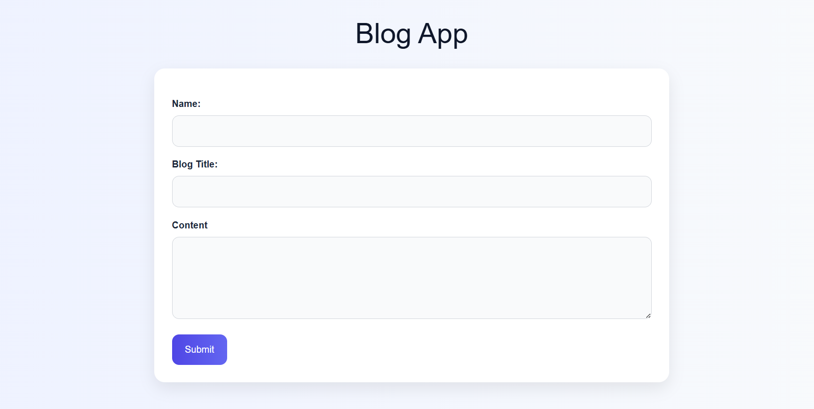

# Blog Web Application

A simple and responsive Blog Web Application built using Node.js, Express.js, and EJS. Users can create, edit, update, and delete blog posts dynamically.

---

## Features

- Create new blog posts
- View all blog posts on the homepage
- Edit existing posts
- Delete posts
- Responsive and modern UI
- Dynamic rendering using EJS templates

---

## Screenshot

---

## What I Learned

- Express.js routing
- EJS templating
- CRUD operations
- Handling form data using body-parser
- Dynamic rendering
- Responsive UI design

---

## Tech Stack

- Node.js
- Express.js
- EJS

---

## Author

- Muskan Kumari

